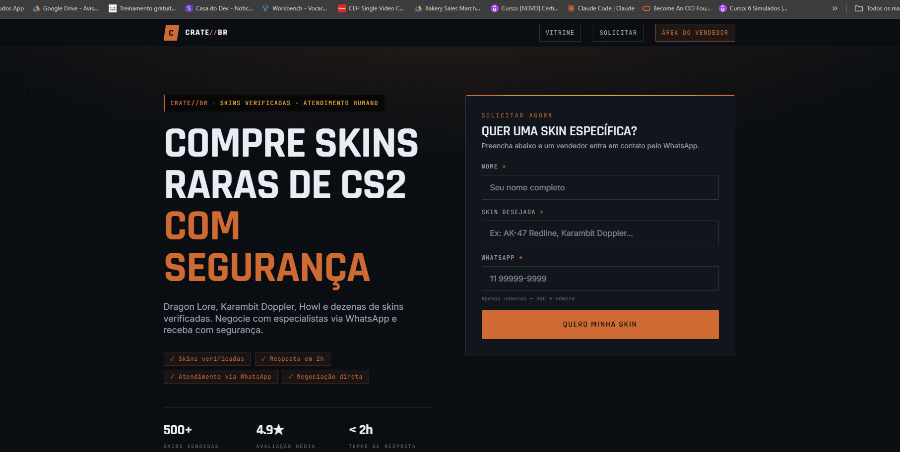

# CrateBr — Marketplace de Skins CS2

Plataforma de compra de skins de CS2 com atendimento via WhatsApp. Clientes solicitam skins por um formulário público e são atribuídos automaticamente a vendedores via round robin.



---

## Stack

| Camada | Tecnologia |
|---|---|
| Frontend | Next.js 16 + TypeScript + Tailwind 4 + TanStack Query |
| Backend | Go 1.23, `net/http` nativo |
| Banco | PostgreSQL 16 |
| Auth | JWT HS256 + bcrypt |
| Infra | Docker + Docker Compose |

---

## Como rodar

**Pré-requisito:** Docker instalado.

```bash
cp .env.example .env
```

Defina um `JWT_SECRET` com pelo menos 32 caracteres no `.env`, depois:

```bash
docker compose up --build
```

O Compose aplica as migrations automaticamente. Aguarde ~30s na primeira vez.

| Serviço | URL |
|---|---|
| Landing page | http://localhost:3000 |
| Dashboard (kanban) | http://localhost:3000/dashboard |
| API | http://localhost:8080 |

**Credenciais padrão**

| E-mail | Senha |
|---|---|
| admin@cratebr.com | senha123 |
| marcelo@cratebr.com | senha123 |

---

## Documentação

| Arquivo | O que cobre |
|---|---|
| [Arquitetura do Backend](./docs/architecture/backend.md) | Camadas Go, rotas, round robin com `FOR UPDATE`, JWT, schema SQL |
| [Docker](./docs/infra/docker.md) | Multi-stage builds, distroless, standalone output, ordem de boot |
| [Dívidas Técnicas e Melhorias](./docs/infra/technical-debt.md) | O que ficou de fora, por quê, e o que viria a seguir |
| [Workflow com Agentes de IA](./docs/agentsworkflow/ai-workflow.md) | Como a IA foi usada durante o desenvolvimento |
